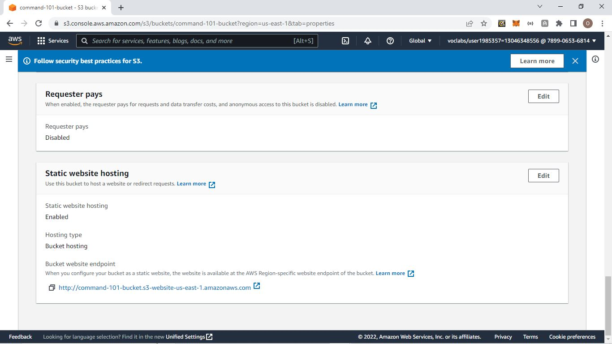

# Hi there 👋

**Welcome to my ALX-T Cloud DevOps Engineer Nanodegree Program Project Page!**

### Project One

<h3>Deploy Static Website on AWS</h3>

In this project, I deploy a static website to AWS using S3, CloudFront, and IAM.

The files included are: 

- index.html - The Index document for the website.
- /img - The background image file for the website.
- /vendor - Bootssrap CSS framework, Font, and JavaScript libraries needed for the website to function.
- /css - CSS files for the website.

## Steps

1. Creat Bucket Image

2. Set S3 Bucket to Support Hosting

3. Static Website Hosting

4. Bucket Poilcy

5. CloudFront Distribution

6. Distribution Domian Name

7. Bucket Name Access

8. Distribution Domian Name Access

## Website Links

- CloudFront endpoint URL for my project <https://d1hol7ajk79pnk.cloudfront.net>

- Website Access via website-endpoint <http://command-101-bucket.s3-website-us-east-1.amazonaws.com>

- Bucket Object Access via its S3 object URL <http://command-101-bucket.s3.amazonaws.com/index.html>

<h3>Connect with me on these platforms:</h3>

<a href="https://github.com/kolaisaac/">
<a href="https://www.linkedin.com/in/kolaisaac10/">

 

- 🌱 I’m always learning, I formed #DL3 (Dedicated Life Long Learner)

- 💬 Ask me about: Cloud Computing, Data Science and Machine Learning

- 😄 Pronouns: He/Him
- ⚡ Fun fact: Bats are the only mammal that can actually fly

*NOTE:* **Resources were deleted after the project was graded**